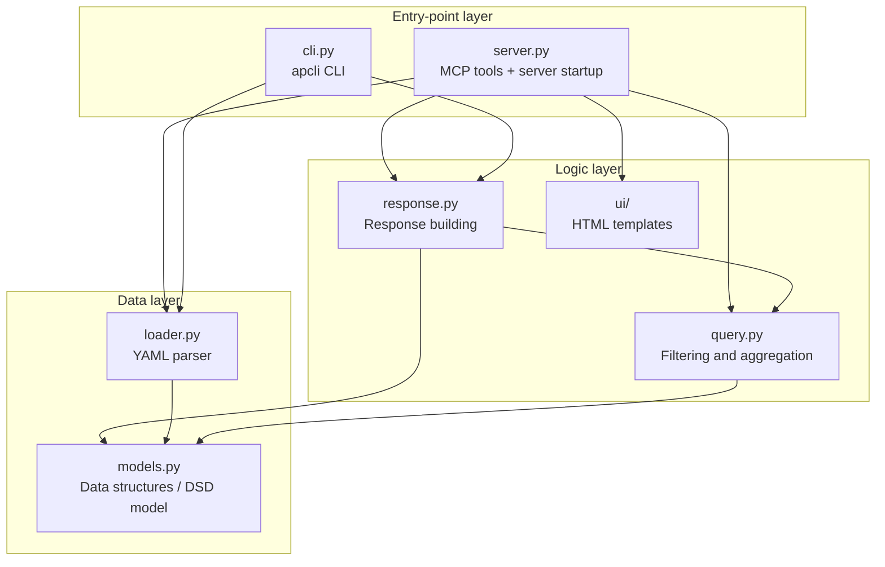
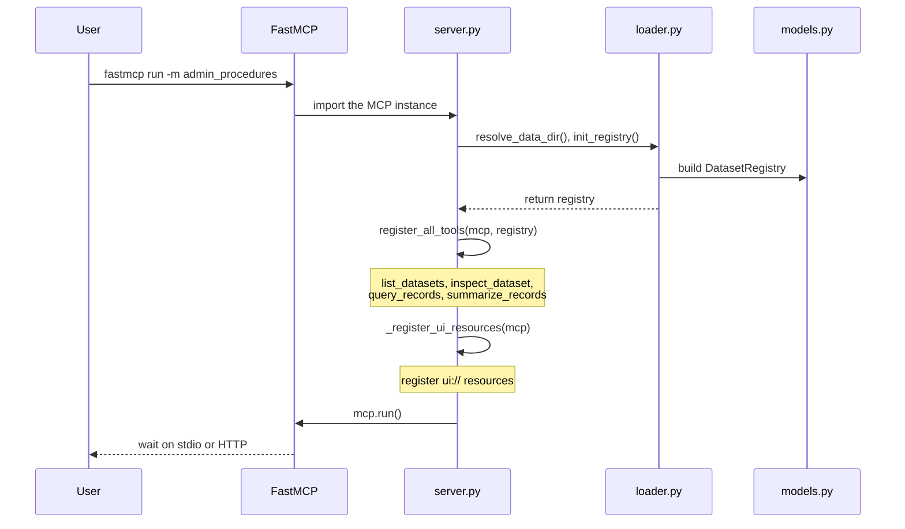

# Development Guide

[日本語](development.md) | English

> This is an English translation of [development.md](development.md). The Japanese version is authoritative; when the two differ, follow the Japanese text. Command examples and configuration snippets are kept identical in both versions.

## 1. Project Overview

This project is a sample implementation for searching and aggregating datasets about Japanese administrative procedures through MCP (Model Context Protocol).

The MCP tools it provides are deliberately limited to the following four.

| Tool | Role |
|---|---|
| `list_datasets` | List the available datasets |
| `inspect_dataset` | Show a dataset's structure, fields, code lists, and quality information |
| `query_records` | Search records by conditions |
| `summarize_records` | Run grouping and aggregation on the server side |

The design borrows from SDMX/DSD (Data Structure Definition) and is metadata-driven. Keeping the number of tools small and each tool's responsibility clear makes it easier for an LLM to pick the right tool.

The main design principles are:

- Describe field roles, code lists, and caveats in `dataset.yaml` so that the AI has less room to guess.
- Run aggregation on the server side wherever possible.
- Include provenance, caveats (`notes`), and quality information such as fill rates in every response.
- Keep the logic layer (`response.py`) independent of MCP.
- Keep `server.py` a thin adapter that converts inputs and builds `ToolResult` objects.
- Share the same logic layer between the MCP server, the CLI, and the tests.
- Allow a new dataset to be added just by placing a YAML file and a Parquet file.

### 1.1 Scope and Trust Boundary

This project is an experimental sample for trying MCP-based search/aggregation and MCP Apps on public data. It targets local execution or a managed, single-user trial. Availability, tenant isolation, and audit features that a multi-user production service, a shared data platform, or a system handling confidential information would need are out of scope.

| Component | Assumptions and responsibility |
|---|---|
| `dataset.yaml` | Treated as trusted input. Because it can specify download URLs and local file locations, never load a YAML file of unknown origin |
| `apcli fetch` | Run explicitly, and only against a `dataset.yaml` whose contents the user has reviewed. Basic defenses (HTTPS only, response size limits, no redirect following) are in place, but this is not a sandbox that safely executes arbitrary configuration. Use `--allowed-host` to restrict the hosts it may connect to |
| stdio / CLI | Intended for local use. Data files are read with the OS user's permissions |
| HTTP transport | The sample itself provides no user authentication, authorization, rate limiting, or audit logging. Add a reverse proxy or similar when exposing it externally |
| `apcli preview` | For UI verification on localhost only. Limit `--unsafe-expose` to isolated test environments; never expose it to the internet or a shared network |

## 2. Project Layout

```text
.
├── pyproject.toml                  # Package definition, dependencies, CLI entry point
├── docs/
│   ├── development.md              # This document (Japanese)
│   ├── development.en.md           # This document (English)
│   ├── dataset-yaml-guide.md       # How to write dataset.yaml (Japanese)
│   └── dataset-yaml-guide.en.md    # How to write dataset.yaml (English)
├── datasets/
│   ├── procedures-survey-r6/       # Dataset definition (FY2024 survey)
│   │   ├── dataset.yaml
│   │   └── data.parquet            # Not bundled. Generated by apcli fetch
│   └── procedures-survey-r7/       # Dataset definition (FY2025 survey)
│       └── dataset.yaml
├── setup.sh                        # First-time setup after clone
├── .mcp.json                       # MCP server definition for Claude Code
├── src/admin_procedures/           # Main package
│   ├── __init__.py
│   ├── __main__.py                 # Entry point for python -m admin_procedures
│   ├── models.py                   # DatasetRegistry, DSD model, field definitions
│   ├── loader.py                   # YAML parser, data directory resolution, registry init
│   ├── query.py                    # Filtering, aggregation, pagination
│   ├── response.py                 # MCP-independent response building and execution pipeline
│   ├── server.py                   # MCP input conversion, ToolResult creation, tool registration
│   ├── cli.py                      # apcli CLI
│   ├── prepare_dataset.py          # Generate YAML and Parquet from CSV
│   ├── preview.py                  # MCP Apps preview host
│   └── ui/
│       ├── __init__.py             # load_template(), render_standalone()
│       ├── base.css / base.js      # Shared CSS / JS
│       ├── echarts.min.js          # ECharts
│       ├── preview_host.html       # Preview host page
│       └── *.html                  # UI template per tool
└── tests/                          # Tests
```

## 3. Architecture

### 3.1 Source Code Dependencies



| Layer | Main responsibility |
|---|---|
| Entry-point layer | Accept input from the MCP server or the CLI |
| Logic layer | Search, aggregate, build responses, and prepare data for UI rendering |
| Data layer | Load YAML definitions and manage data structures |

By confining MCP-specific handling to `server.py`, the search and aggregation logic can be reused from the CLI and the tests.

### 3.2 Server Startup Sequence



At startup the server resolves the data directory, loads each `dataset.yaml`, builds the `DatasetRegistry`, registers the four MCP tools, and registers the UI resources for MCP Apps.

## 4. Runtime Environment and Dependencies

### 4.1 Environment Variables

| Variable | Default | Description |
|---|---|---|
| `ADMIN_PROCEDURES_DATA_DIR` | unset | Path to the directory that contains `datasets/` |
| `ADMIN_PROCEDURES_PORT` | unset | When set, start the server with the streamable HTTP transport |
| `ADMIN_PROCEDURES_HOST` | `127.0.0.1` | Bind address for the HTTP transport (effective only when `ADMIN_PROCEDURES_PORT` is set) |
| `ADMIN_PROCEDURES_PUBLIC` | unset | Set to `1` to bind with `ADMIN_PROCEDURES_HOST=0.0.0.0` (public mode). A reverse proxy with authentication is mandatory when exposed |
| `MCP_NO_UI` | unset | Set to `1` to disable the MCP Apps UI |

### 4.2 Python Runtime

| Package | Version | Purpose |
|---|---|---|
| [polars](https://pola.rs/) | `>=1.0` | Search and aggregation through LazyFrame, CSV to Parquet conversion |
| [PyYAML](https://pyyaml.org/) | `>=6.0` | Loading `dataset.yaml` |
| [FastMCP](https://gofastmcp.com/) | `>=3.2.0` | MCP server framework |
| [click](https://click.palletsprojects.com/) | `>=8.0` | Command definitions for `apcli` |

The FastMCP 3.x CLI is built on Cyclopts and does not depend on Click, so Click is declared as a direct dependency of this project in `pyproject.toml`.

### 4.3 Front-end and Development Packages

Front-end libraries are bundled under `ui/` and injected inline into the HTML.

| Kind | Package | Version | Purpose |
|---|---|---|---|
| Front-end | [Apache ECharts](https://echarts.apache.org/) | `6.1.0` | Bar, pie, heatmap, treemap, Sankey, and other charts |
| Development | [pytest](https://docs.pytest.org/) | `>=9.0.2` | Test runner |

## 5. Input Limits and Computational Caps

To limit resource consumption, the MCP tools enforce the following input limits.

### Limits for query_records

| Parameter | Limit | Description |
|-----------|------|------|
| `q` | up to 1024 characters | Full-text search keyword |
| `search_fields` | up to the number of fields | Number of fields to search |
| `select` | up to the number of fields | Number of output fields |
| `where` | up to 200 fields | Number of fields in the filter |
| `where` arrays (IN / contains) | up to 200 elements | Array size in one filter condition |
| `limit` | 1 to 5,000 | Number of records returned (default 50) |
| `cursor` | up to 2 KiB | Pagination cursor |

### Limits for summarize_records

| Parameter | Limit | Description |
|-----------|------|------|
| `metrics` | up to 200 | Number of aggregation measures |
| `group_by` | up to 200 fields | Number of cross-tabulation axes |
| `where` | up to 200 fields | Number of fields in the filter |
| `limit` | 1 to 10,000 | Number of groups returned (default 200) |

### Error Handling

Input that exceeds a limit is rejected as an MCP **ToolInputError**.
The error message carries the details.

**Example:**
```json
{
  "error": "q は 1024 文字以内です（入力: 2048 文字）"
}
```

(The message reads "q must be at most 1024 characters (input: 2048 characters)". Error messages from the server are in Japanese.)

**Control character restriction:**
Metadata fields (`title`, `publisher`) are rejected if they contain newlines (`\n`, `\r`) or control characters (`\t`, `\x00`, `\x1b`, and so on).

## 5.1 MCP Specification and FastMCP Compatibility

The project is designed to run on both the FastMCP 3.x and 4.x series. The MCP specification version actually in use is determined by the installed FastMCP and MCP SDK versions.

| Installation | FastMCP | MCP SDK | MCP spec |
|---|---|---|---|
| Default (`pip install -e .`) | 3.x | 1.x | `2025-11-25` |
| With the FastMCP 4.x pre-release | 4.x | 2.x | `2026-07-28` |

When running on the HTTP transport, the effective MCP specification version can be read from `mcp_protocol_version` at `/health`.

```bash
curl localhost:8000/health
```

Example response:

```json
{
  "status": "healthy",
  "mcp_protocol_version": "2026-07-28"
}
```

To run on MCP specification `2026-07-28`, install FastMCP 4.x and MCP SDK 2.x.

```bash
pip install --pre "fastmcp>=4.0.0b1"
```

Notes when using FastMCP 4.x:

- At the time of writing, FastMCP 4.x is the pre-release `4.0.0b1`.
- FastMCP 4.x depends on Cyclopts 5.x alpha.
- CI watches for FastMCP 4.x regressions in the `pytest-spec-2026` job.
- `pytest-spec-2026` runs with `continue-on-error`, so a failure on FastMCP 4.x does not block the normal CI result.
- The default FastMCP 3.x is recommended for production use.

## 6. Tests

### 6.1 Running the Tests

```bash
python -m pytest tests/ -x
```

`-x` stops the run at the first failing test.

### 6.2 Test Layout

| File | Main contents |
|---|---|
| `test_server.py` | Registration and invocation of MCP tools using `_FakeMCP` |
| `test_procedures.py` | Unit tests for aggregation, pagination, DSD validation, provenance, and so on |
| `test_cli.py` | CLI validation, basic commands, fetch source validation |
| `test_loader.py` | Loading YAML/DSD, auto-registration |
| `test_response.py` | Regression tests for response building |
| `test_mcp.py` | MCP instance creation, cache hint declarations |
| `test_preview.py` | Preview host, HTTP endpoints, Host/CSRF validation |
| `test_limits.py` | Input length, array size, query and aggregation caps |
| `test_dataset_schema.py` | Conformance of every bundled `dataset.yaml` to the JSON Schema |
| `test_bundled_datasets.py` | Consistency between the bundled dataset definitions (FY2024 and FY2025) |
| `test_bundled_data.py` | Consistency between the bundled definitions and the fetched data (detects semicolon-joined values in single-value fields; skipped when the Parquet file is absent) |
| `test_docs_sync.py` | Code examples in the Japanese and English documents stay identical |
| `conftest.py` | Shared fixtures, four sample records, a test registry |

### 6.3 Test Data

Tests in `test_cli.py` that depend on `procedures-survey-r6` do not download the real dataset (roughly 100 MB). Instead, the four sample records defined in `conftest.py` are written to a temporary directory for each test run.

This avoids longer CI runs, dependence on external networks, and failures from downloading large files.

The sample data is applied automatically to the following test classes.

| Test class | What it verifies |
|---|---|
| `TestQueryUnknownSelect` | Errors when an unknown field is selected |
| `TestSummarizeUnknownExplode` | Errors when an invalid field is given to explode |
| `TestSummarizeNonGroupable` | Validation of non-groupable fields |
| `TestSummarizeUnknownGroupBy` | Validation of unknown group-by fields |
| `TestCLIBasicCommands` | Basic CLI commands |

Other test classes such as `TestAddCommand` use their own CSV fixtures per test.

## 7. MCP Apps UI and Preview

Claude Code does not render MCP Apps UI, so the project offers three ways to check it.

| Method | Use |
|---|---|
| Static preview | Emit self-contained HTML with `apcli <command> --html` or `-o` and open it in a browser |
| Interactive preview | Start an SEP-1865-compliant preview host on localhost with `apcli preview` and exercise the built-in browser AI and UI rendering end to end |
| External host | Connect to `basic-host` or MCPJam Inspector to observe behavior closer to a real host |

### 7.1 Static Preview

Passing `--html` or `-o` to any `apcli` command emits the self-contained HTML produced by `render_standalone()`.

```bash
apcli <command> --html
apcli <command> -o output.html
```

The data is embedded in the HTML, so the file can be opened directly in a browser.

### 7.2 Interactive Preview

`apcli preview` starts an SEP-1865-compliant preview host using `preview.py` and `ui/preview_host.html`. It uses Gemini Nano in Chrome and Phi-4-mini (or Aion-1.0-Instruct) in Microsoft Edge Canary/Dev to choose which MCP tool to call for a user's question.

```bash
apcli preview [OPTIONS]
```

| Option | Default | Description |
|---|---|---|
| `--port PORT` | `8765` | Listening port |
| `--host HOST` | `127.0.0.1` | Bind host (localhost only by default) |
| `--unsafe-expose` | off | Allow binding to a non-loopback address such as 0.0.0.0 |
| `--no-open` | off | Do not open the browser automatically |

Examples:

```bash
apcli preview
apcli preview --port 9000
apcli preview --no-open
```

By default the host starts at:

```text
http://127.0.0.1:8765
```

The Prompt API has no native tool-calling feature, so a JSON Schema is passed as `responseConstraint` and the model is made to choose between `tool_call` and `answer`. After a tool runs, the UI is rendered as follows.

While a question is being processed, the progress steps (session preparation › tool selection › argument generation › execution › feedback › answer) are shown on one line with elapsed seconds, and the partial output received through `promptStreaming()` streams below the line. `LanguageModel.create()` runs under a watchdog (120 s by default) with an AbortSignal, and the "中止" (cancel) button aborts the call in progress. The following URL parameters help isolate problems.

| Parameter | Description |
|---|---|
| `?ptimeout=<ms>` | Timeout for `prompt()` (default 60000) |
| `?ctimeout=<ms>` | Watchdog for `create()` (default 120000) |
| `?stream=0` | Call `prompt()` instead of `promptStreaming()` |
| `?schema=0` | Do not pass `responseConstraint` (structured output); useful where structured output crashes the model process |
| `?flow=1` | Disable the two-phase flow (tool selection → argument generation) and use a single stage |

The Prompt API names follow Chrome 151 (spec draft 2026-08): `contextUsage` / `contextWindow`, the `contextoverflow` event, and `samplingMode`. `temperature` / `topK` are ignored on web pages and are passed only for backward compatibility.

```text
ui/initialize
    ↓
ui/notifications/tool-result
    ↓
render the UI inside an iframe
    ↓
drill down with tools/call as needed
```

### 7.3 Supported Browsers

| Browser | Version | Model | Initial setup |
|---|---|---|---|
| Chrome | 138 or later | Gemini Nano | Set `chrome://flags/#prompt-api-for-gemini-nano` to Enabled, then set `chrome://flags/#optimization-guide-on-device-model` to Enabled BypassPerfRequirement, and restart Chrome |
| Microsoft Edge | 131 or later | Phi-mini | In `edge://flags`, set "Prompt API for on-device language model" to Enabled and restart Edge |

Both browsers download the model on first use. The download UI follows the browser guidelines.

- The download starts only when the user presses the button in the banner.
- Progress is shown with `<progress>` during the download.
- Progress is shown as indeterminate while the model is being unpacked.
- The chat input stays disabled until the model is ready.
- `availability()` receives the same language options as `create()`.

To check the first-download behavior, start Chrome with an empty user profile.

```bash
chrome --user-data-dir=$(mktemp -d)
```

### 7.4 Usage Flow

1. Run `apcli preview` and open the preview host in the browser.
2. `list_datasets` runs automatically and the datasets are shown as tiles.
3. Click a dataset tile.
4. `inspect_dataset` runs automatically for the selected dataset.
5. Type a question in the chat box.
6. The built-in AI picks the appropriate tool among `list_datasets`, `inspect_dataset`, `query_records`, and `summarize_records`.
7. The result is rendered as a chart or table inside an iframe.
8. Drill down from the chart or table to detailed data as needed.

### 7.5 Compatibility Checks with External Hosts

To check behavior in an environment closer to a real MCP Apps host, use the following.

- [basic-host](https://github.com/modelcontextprotocol/ext-apps/tree/main/examples/basic-host): the official reference host included in `ext-apps`. Requires Node.js.

Host-specific behavior such as the sandbox iframe proxy is verified with an external host.

### 7.6 Troubleshooting

| Problem | Likely cause | Fix |
|---|---|---|
| "Built-in AI: unavailable" is shown | The model has not been downloaded, or the browser flag is disabled | Enable the flag and restart the browser |
| The preview host does not start | The port is in use | Pick another port with `--port` |
| JSON is shown instead of the UI | The iframe or the template failed to render | Open the developer tools and check the console for errors |
| The model download does not progress | Disk space or network problems | Check for at least 22 GB of free space and a working network connection |

## 8. SLM Harness Design

> The specifications, performance, and availability of SLMs and built-in browser AI change quickly. The SLM harness described in this chapter is a test and experimental implementation.

In the interactive preview, a JavaScript harness handles orchestration and state, while the SLM (Gemini Nano or Phi-mini) builds the search and aggregation queries.

Delegating multi-step exploration to a small model makes tool selection and argument generation unstable, so dataset discovery and structure inspection are executed by the harness.

When the page starts, the following steps run as visible tool executions.

```text
list_datasets
    ↓
inspect_dataset
    ↓
store field and quality information locally
    ↓
inject into the system prompt
```

The stored information includes field names, descriptions, whether `group_by` is allowed, whether `sum`/`avg` are allowed, fill rates, code lists, and caveats. Later calls use it for the `dataset_id` enumeration, field name correction, quality annotations, and past observations.

The SLM is expected to obtain what it needs for an answer with a single `summarize_records` or `query_records` call. Few-shot examples are limited to three of the form "question → tool call JSON → tool result → final answer" to reduce the risk of the model reusing the numbers and field names from the examples.

### 8.1 Design Principles

| Principle | Description |
|---|---|
| Generality | The harness prompt, few-shot examples, and example chips are generated solely from `/api/describe`, `list_datasets`, and `inspect_dataset`. Dataset-specific wording is never embedded in the JavaScript |
| MCP tools untouched | Accuracy improvements for the SLM are made on the harness side. The MCP tool definitions and the server are not changed |
| Measurement-driven | Countermeasures are added only for problems actually observed, such as key names in other languages, broken JSON, or reuse of few-shot numbers |

The main harness countermeasures are output constraints through JSON Schema, argument sanitization, field name correction, a repair re-prompt for broken JSON, and injection of quality information and rules into the system prompt.

### 8.2 Auxiliary Features

| Feature | Default | Description |
|---|---|---|
| CoT (plan-then-act) | off | Enable with `?cot=1`. Makes the model write a one-line plan before the constrained output, including a caveat when using low-fill-rate fields. In practice the model often stops at the plan and never calls a tool, so this is kept for A/B comparison only |
| Reflection prompt | on | When a tool returns zero records or an error, prompt the model to revise the conditions or arguments and retry |
| Catalog cache | fallback only | Every session runs `list_datasets` and `inspect_dataset` visibly. The stored information is used only if `inspect_dataset` fails |
| Lesson memory | off | Enable with `?lessons=1`. Records calls that returned zero records or errors together with the call that later succeeded, and injects them into the next system prompt as "past lessons" |
| Observation store | on | From successful calls, stores the number of groups per group_by, top values, keyword hit counts, and successful search conditions, and adds them only to related questions |

## 9. Adding a Dataset

A new dataset can be added without changing any code. There are three steps.

### Step 1: Generate a YAML template and Parquet from CSV

```bash
python -m admin_procedures.prepare_dataset my-dataset \
  --csv path/to/data.csv
```

`prepare_dataset.py` analyzes the CSV and generates the following files.

```text
datasets/my-dataset/
├── dataset.yaml
└── data.parquet
```

In the generated `dataset.yaml`, the role of each field is inferred automatically.

| role | Use |
|---|---|
| `id` | Field that identifies a record |
| `dim` | Field used for classification and grouping |
| `measure` | Field to aggregate with sum, average, and so on |
| `attr` | Supplementary information or attributes |

Right after generation, `desc`, `notes`, and similar entries may be empty.

### Step 2: Complete the YAML

If a document that explains the survey items exists, it is efficient to feed the following to a generative AI.

| Input | Purpose |
|---|---|
| `dataset-yaml-guide.en.md` | The YAML specification |
| The item explanation document | The meaning, allowed values, and entry rules of each field |
| The generated `dataset.yaml` | The file to complete |

Example instruction:

> Following the specification in `dataset-yaml-guide.md`, and based on the item explanation document, fill in `desc`, `codelist`, `notes`, and `computed_measures` in `dataset.yaml`.

Do not use the generated result as is; review and adjust it by hand. In particular, check the following.

- Do the `codelist` values match the actual data?
- Are caveats about interpreting numeric fields written in `notes`?
- Can `0` be distinguished from "unknown or missing"?
- Are the numerator and denominator field names in `computed_measures` correct?
- Are administrative fields that users do not need, such as update timestamps and internal flags, excluded?

### Step 3: Regenerate Parquet from the YAML

When fields are added, removed, or changed in the YAML, regenerate the Parquet file.

```bash
python -m admin_procedures.prepare_dataset my-dataset \
  --csv path/to/data.csv
```

If `dataset.yaml` exists in the target directory, `prepare_dataset.py` automatically runs in convert mode and converts the CSV according to the YAML definition.

See [dataset-yaml-guide.en.md](dataset-yaml-guide.en.md) for the full format.

## 10. CSV to Parquet Conversion Rules

| CSV value | String column | Numeric column (`data_type: integer`) |
|---|---|---|
| Value present | Kept as a string | Converted to `int64` |
| Empty string `""` | `null` | `null` |
| String that cannot be parsed as a number | Kept as a string | `null` |

Empty cells in numeric columns are kept as `null`, not `0`.

| Value | Meaning |
|---|---|
| `null` | No data, unknown, or not answered |
| `0` | The value is confirmed to be zero |

This distinction matters for interpreting aggregation results and fill rates correctly.

## 10.1 Metadata Validation

The `title` and `publisher` fields of `dataset.yaml` are sanitized automatically:

- **Length limit**: 256 characters at most
- **Character restriction**: newlines (`\n`, `\r`) and control characters (`\t`, `\x00`, `\x1b`, and so on) are rejected

## 11. Contributions

This project is sample code published for technical evaluation.

As a rule, external contributions such as feature additions, specification changes, and refactoring are not accepted. Please note that issues and similar submissions may not be acted on or merged.
